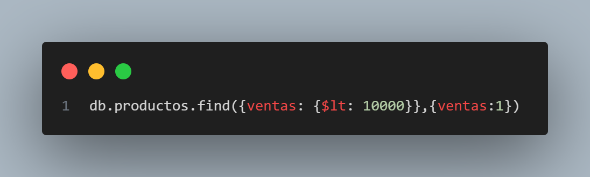

# Practica 1: Base de Datos, colecciones e inserts

1. Conectarnos con mongosh a MongoDB

2. Crear una base de datos llamada curso

3. Comprobar que la base de datos no existe

4. Crear una coleccion que se llame facturas y mostrarla

5. Insertar un documento con los siguientes datos:

| Codigo   | Valor   |
|-------------|-------------|
| Cod_Factura | 10 |
| Ciente | Frutas Ramirez |
| Total | 223 |

| Codigo   | Valor   |
|-------------|-------------|
| Cod_Factura | 20 |
| Ciente | Ferreteria Juan |
| Total | 140 |

6. Crear una nueva colección pero usando directamente el insertOne.
   insertar un documento en la colección productos con los siguientes datos:

| Cod_producto | Nombre         | Precio |
|--------------|----------------|--------|
| 1            | Tornillo x 1"  | 2      |

7. Crear un nuevo documento de producto que contenga un array. Con los siguientes datos:

| Cod_producto | Nombre   | Precio | Unidades | Fabricantes               |
|--------------|----------|--------|----------|---------------------------|
| 2            | Martillo | 20     | 50       | fab1, fab2, fab3, fab4    |

8. Borrar la colección Facturas y comprobar que se borro

9. Insertar un documento en una colección denominada **fabricantes**
   para probar los subdocumentos y la clave _id personalizada

| Codigo   | Valor   |
|-------------|-------------|
| id | 1 |
| Nombre | fab1 |
| Localidad | ciudad: buenos aires, pais: argentina, Calle: Calle pez 27,cod_postal:2900 |

10. Realizar una inserción de varios documentos en a colección
    productos

| Codigo   | Valor   |
|-------------|-------------|
| Cod_producto | 3 |
| Nombre | Alicates |
| Precio | 10 |
| Unidades | 25 |
| Fabricantes | fab1, fab2, fab5 |

| Codigo   | Valor   |
|-------------|-------------|
| Cod_producto | 4 |
| Nombre | Arandela |
| Precio | 1 |
| Unidades | 500 |
| Fabricantes | fab2, fab3, fab4 |

