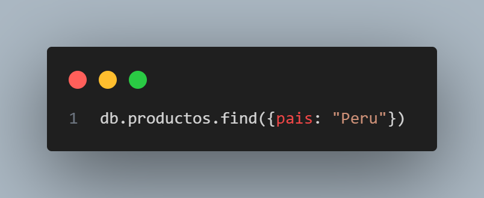
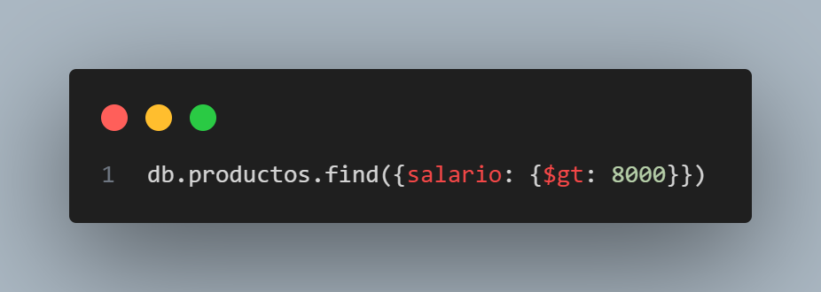
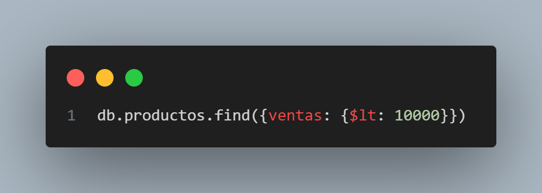
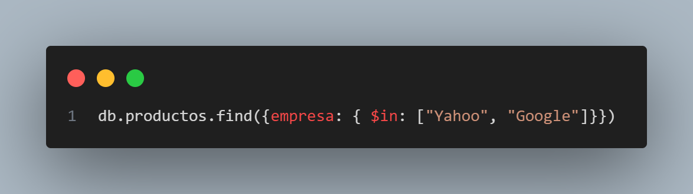
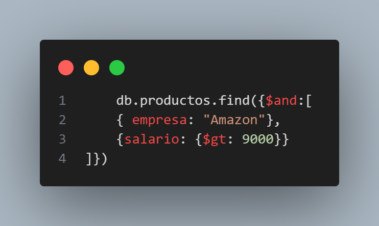
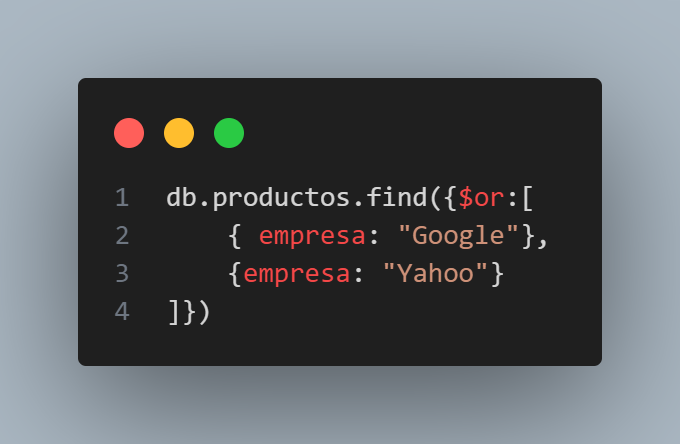
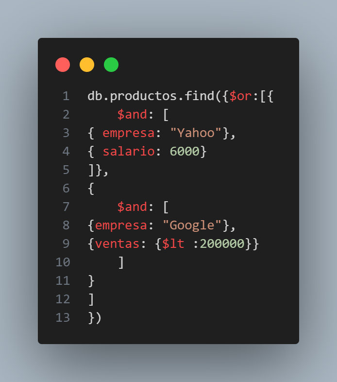
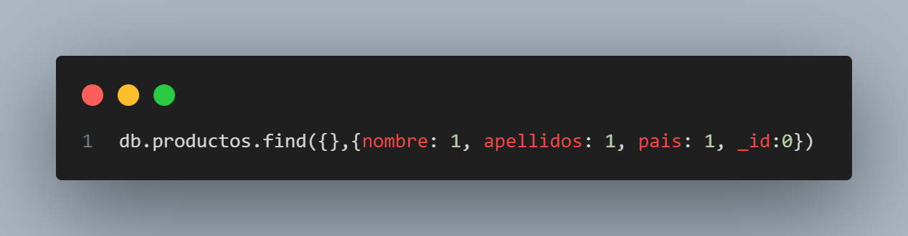

1. Cargar el archivo empleados.json

2. Utilizar la base de datos curso

3. Buscar todos los empleados que trabajen en google


4. Empleados que vivan en peru

5. Empleados que ganen mas de 8000 dolares

6. Empleados con ventas inferiores a 10000



7. Realizar la consulta anterior pero devolviendo una sola fila


8. Empleados que trabajan en google o en yahoo con el operador $in


9. Empleados de amazon que ganen mas de 9000 dolares


10. Empleados que trabajan en Google o en Yahoo con el operador $or



11. Empleados que trabajen en Yahoo que ganen mas de 6000 o empleados que trabajen en Google que tengan ventas inferiores a 20000
```json
    db.productos.find({$or:[{
        $and: [
    { empresa: "Yahoo"},
    { salario: 6000}
    ]},
    {
        $and: [
    {empresa: "Google"},
    {ventas: {$lt :200000}}
        ]
    }
    ]    
    })
```


12. Visualizar el nombre, apellidos y el país de cada empleado
```json
db.productos.find({},{nombre: 1, apellidos: 1, pais: 1, _id:0})
```
