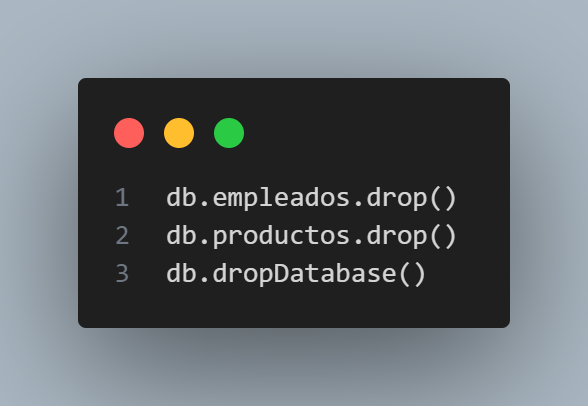

# Practica 3. Updates y Deletes

1. Cambiar el salario del empleado Imogene Nolan. Se le asigna 8000.

2. Cambiar "Belgium" por "Bélgica" en los empleados (debe haber dos).
db.productos.updateMany

4. Reemplazar el empleado Omar Gentry por el siguiente documento:

5. Con un find comprobar que el empleado ha sido modificado

6. Borrar todos los empleados que ganen mas de 8500. Nota: deben ser borrados 3 documentos

7. Visualizar con una expresión regular todos los empleados con apellidos que comiencen con "R"

8. Buscar todas las regiones que contenga un "V". Hacerlo con el operador $regex y que no distinga mayúsculas y minúsculas. Deben salir 2

9. Visualizar los apellidos de los empleados ordenados por el propio apellido.

10. Indicar el número de empleados que trabajan en Google.

11. Borrar la colección empleados y la base de datos
